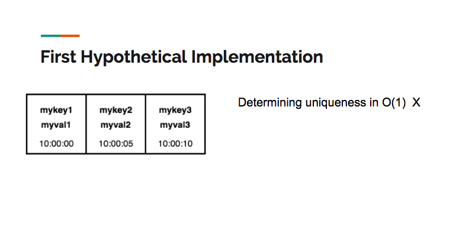
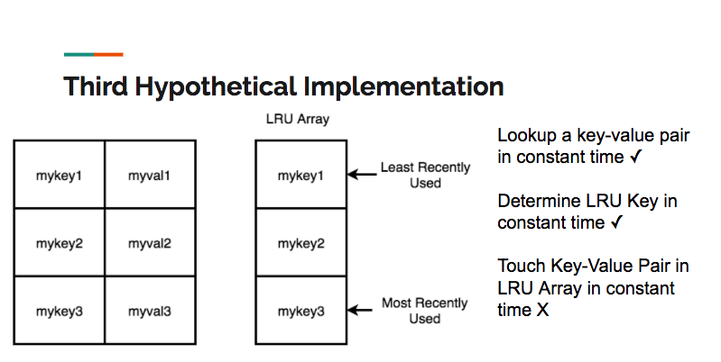

# CorvoStore

[CorvoStore](https://github.com/corvostore) is an in-memory key-value store with complex data types in the value space and optional persistence.  It was inspired by [Redis](https://Redis.io/), and built by [Peter Reznick](http://www.preznick.com/), [Kalyan Vedala](https://github.com/vedala) and [Preeti Viswanathan](https://github.com/preeV42500).

We were interested in experiencing the challenge of building a significant distributed system, and learning how Redis works and achieves it’s big-O time-complexity benchmarks.  To this end, we set out to build CorvoStore from scratch, with Redis as a model.  Our [server](https://www.npmjs.com/package/corvoserver) can be downloaded via NPM, as can our JS [client](https://www.npmjs.com/package/corvo-node-client).

This site provides a brief introduction to CorvoStore, its core data structures, and its underlying architecture.  For instructions on installing and using our client or server, please refer to each module’s NPM documentation.

## Table of Contents

 1. [CorvoStore and Redis](#corvostore_redis)
 2. [Core LRU Structure](#LRU)
 3. [Structure of a Data Type: Sorted Set](#sorted_set)
 4. [System Architecture](#architecture)
 5. [Limitations and Next Steps](#limitations)
 6. [Conclusion](#conclusion)

## <a id="corvostore_redis">CorvoStore and Redis</a>

Redis is a highly-performant in-memory key-value store.  In other words, it’s a fast, dictionary-like noSQL database that sits in memory.  In addition Redis features a variety of eviction policies, in other words, algorithms for determining which keys and values are flushed from the store in the event that the store's size exceeds the maximum memory level set by the user.  Redis also supports complex data types as values.  This means that Redis can store, say, a List or a Set as a value, and allows the user to perform operations on this data type after reading it through its key.  In addition, Redis supports optional on-disk persistence.

CorvoStore is an experimental project.  Our goals were not to create a production application or to match Redis’ performance in absolute terms, but rather to experience the challenge of developing a non-trivial distributed application and learn more about Redis’ data-structure level implementation.  We did this by matching Redis’s big O time complexity for operations on the store and on the complex data-type values.

To this end, we implemented two node modules available for download via NPM.  The first is an embedded JavaScript client, and the second is a server, which listens on the same port and possesses the same command-level API as the Redis server itself.  Because we matched the command API and TCP-level protocol for server-client communication, our server is interoperable with Redis clients.

## <a id="LRU">LRU Data Structure</a>

The first problem we sought to tackle was how to go about implementing a Redis-style key value store at the data-structure level.  In order to do this, we had to come up with a data-structure that satisfied the following constraints:

 - Must be a dictionary,
 - Must meet performance criteria: O(1) lookup, insertion, and deletion,
 - Must be able to flush data when maximum allowed memory is reached.

A dictionary is a data structure with key and value space, where each key is a unique string that maps to a value.  Redis allows for a variety of data types as values, of which we implemented five: String, Hash, List, Set, and Sorted Set.  Our store also had to meet Redis’s big-O performance criteria, that is, it had to manage constant time lookup, insertion, and deletion.  Finally, like Redis, our store had to implement an eviction policy, an algorithm for flushing data when we reached our max allowed memory.  We chose to adopt the [Least-Recently-Used eviction policy](https://en.wikipedia.org/wiki/Cache_replacement_policies#Least_Recently_Used_(LRU)) because of its centrality to Redis’s most common use case: that of LRU cache.

LRU works by maintaining data on the last time that each key in the store was “touched”, where a touch means insertion, update or read.  When an insertion or update causes the max memory allocation for the store to be reached, the store performs one or more LRU deletions until the store has enough space to accommodate the changes.  An LRU deletion is the removal of the least-recently-touched key-value pair.

A first hypothetical implementation could use an array as the underlying data structure.  However, determining uniqueness (which would require a search) is an O(N) operation, and as a result, a simple array isn't viable:


A second hypothetical implementation would use a hash table as the underlying data structure.  A hash table allows for constant time search, insertion and deletion, satisfying more of the criteria than an array.  However, a hash table alone can't maintain the LRU order:


What about a hash table in conjunction with an array, where the array stores the LRU order?  Unfortunately, although we could add a key value pair to the store in constant time, any other operation is potentially O(N), since it would require moving elements from the front or middle of the array to the end:


Our final implementation satisfies all of the constraints: a hash table in conjunction with a doubly linked list.  In this implementation, all of the keys are held in the hash table, thereby satisfying the constant time uniqueness constraint.  Each of the values associated with the keys holds a reference that points to a node in the doubly linked list.  Since a doubly-linked list allows us to move a node from any position in the list to the tail in constant time, we can now touch all of the keys in constant time.  Here is a representation of the data structure we used in our final implementation:


## <a id="sorted_set">Structure of a Data Type: Sorted Set</a>

The sorted set data type in Redis is a collection of unique pairs of string members and numeric scores. The benefit of using a sorted set is that elements are kept in order based on their score. The members themselves must be unique, but the scores can be duplicated. In the case of duplicate scores, the members associated with those scores are sorted alphabetically.  

In our implementation of the sorted-set data type for CorvoStore, we had to match the following time-complexity benchmarks:

 - Score read with member: O(1)
 - Search: O(log N)
 - Insertion: O(log N)
 - Deletion: O(log N)

To make the read operation a constant time operation, we used a hash table to store the members as keys with their scores as values.  However, we still need to maintain the order of the members in the sorted set, in such a way that binary search and write operations are possible.

To maintain O(log(N)) time for insertion and removal operations, and to more effectively handle the possibility of duplicate scores, we used a probabilistic data structure called a skip list.  A skip list can be thought of as a variation of a multi-level linked list where each level’s elements are ordered. Nodes have up and down pointers in addition to the left and right pointers that are standard in doubly linked lists.

The defining feature of a skip list is that it is a probabilistic structure. What this means is that every time a new element is added to the lowest level of the list, it could repeatedly be added to upper levels of the list as well, and this addition happens a random number of times. This random addition of some nodes vertically through multiple levels means that when we traverse across a single level, we can ‘skip’ over many nodes that are present in the level below.

This ability to ‘skip’ nodes as we traverse a level is similar to binary search, which is why searching for a node in a skip list has, on average, O(log(N)) time complexity.  A diagram of this composite data structure is below:


## <a id="architecture">System Architecture</a>

A diagram of our final system architecture:


At the top level we have two Node modules, one for the embedded JS client, and another for the server.

### The Client

The client exposes methods to the user that generate TCP/IP requests.  Each method on the client object exposed when the module is imported corresponds to a Redis command, and takes appropriate arguments.  For example, the async client method set:

```javascript
async set(key, val, ...flags) {
  const writeDone = await this.writeToServer("SET", key, val, ...flags);
  const returnVal = await this.resolveOnData();
  return returnVal;
}
```

corresponds to Redis’s SET key value command.  We use asynchronous methods in the client because the successful execution of the method depends upon receipt of a TCP/IP response from the server.

The client has two special structures -- encoder and decoder -- that are responsible for creating and parsing the RESP-formatted strings that make up the body of the TCP/IP requests and server responses.

RESP (Redis Serialization Protocol) is the set of rules that govern how string-type data sent over TCP/IP between the client and server should be formatted.  By adopting RESP protocol, we rendered our client and server interoperable with Redis’s own clients and servers.

### The Server

The server is responsible for parsing the request, writing it into our LRU store data structures, incrementing memory, and optionally persisting the command to disk.

The server handles the request by means of an event listener that is set every time a connection is established between a client and server.  Whenever the connection emits a ‘data’ event -- whenever the client has sent data to the server -- the listener invokes the callback.  The callback then processes the RESP request’s data.  After extracting the RESP string from the client request in the callback, the server passes it to the parser.

The parser validates the tokens.  This validation has two dimensions.  The parser checks that RESP string is properly formatted and also checks to make sure that the number of tokens make sense for the given operation.  Having parsed and verified the tokens, the server then executes the appropriate method on the store.  In our case, it will execute the method responsible for writing a string value into the store.

The store method is where the data from the client is finally inserted into our LRU data structures.  Here, we have the CorvoStore setString method:

```javascript
setString(key, value) {
  const accessedNode = this.mainHash[key];

  if (accessedNode === undefined) {
    const newNode = new CorvoNode(key, value);
    this.mainHash[key] = newNode;
    this.mainList.append(newNode);
    this.memoryTracker.nodeCreation(newNode);
  } else {
    const oldValue = accessedNode.val;
    accessedNode.val = value;
    this.memoryTracker.stringUpdate(oldValue, value);
    this.touch(key);
  }
  this.lruCheckAndEvictToMaxMemory();
  return "OK";
}
```

An important part of this write operation involves appropriately incrementing or decrementing our representation of the current memory allocation.  The memory tracker object exposes methods that the store uses to increment or decrement the representation of current memory allocation, which is used to determine when to perform an LRU deletion.  The memory tracker is used every time a write operation is performed on the store.

Like Redis, CorvoStore supports Append-Only-File persistence.  This means that if a write request is made to the server, it appends this request to the end of a file on disk.  Then, if the server crashes for some reason, the file on desk has a list of all of the operations needed to reconstitute the store’s state.

In order to implement this persistence, after parsing the commands, the server checks whether the specified operation is a write, and whether or not the operation was successfully performed on the store.  If the operation is a write, and it was successful, then the server appends it to a file on disk via an open write stream.

## <a id="limitations">Limitations and Future Plans</a>

### Improve Memory Tracker

Our memory tracker is an approximation, rather than exact count, of the memory currently used by the store.  The actual memory allocation is dynamic; it depends on the number of objects instantiated in a given runtime, and is managed by JS’s V8 engine.
We want to explore further whether the V8 engine provides any APIs that would allow us to more precisely gauge current memory usage.


### Make More Clients
Our client coverage is currently limited to a JavaScript embedded client node module.  We would like to implement embedded clients in other languages, notably Ruby, and also develop a command line client.

### Add Key Expiry and Further Eviction Policies

Redis supports a variety of eviction policies.  Many of these policies depend on key expiry, a feature that the user can use to optionally flush key-value pairs out of the store after a particular time interval.  The critical step in expanding the range of eviction policies we support would be to implement expiry functionality for all keys.

### Optimize AOF Persistence

Because of its journal-like nature, AOF persistence can quickly produce a very large file on disk.  Redis has several approaches to addressing this potential problem, including parsing large numbers of write requests into single, condensed request with the same effect, as well as periodically generating a snapshot-style AOF representation of the state at specific time-intervals, and replacing the journal AOF file that has been maintained since the server started running.  We would like to explore implementing one or both of these file-size optimization strategies.

## <a id="conclusion">Conclusion</a>

Thanks for reading about CorvoStore!

We are all currently open to new opportunities, so don’t hesitate to get in touch with [Peter Reznick](http://www.preznick.com/), [Kalyan Vedala](https://vedala.github.io/) or [Preeti Viswanathan](https://github.com/preeV42500)!
